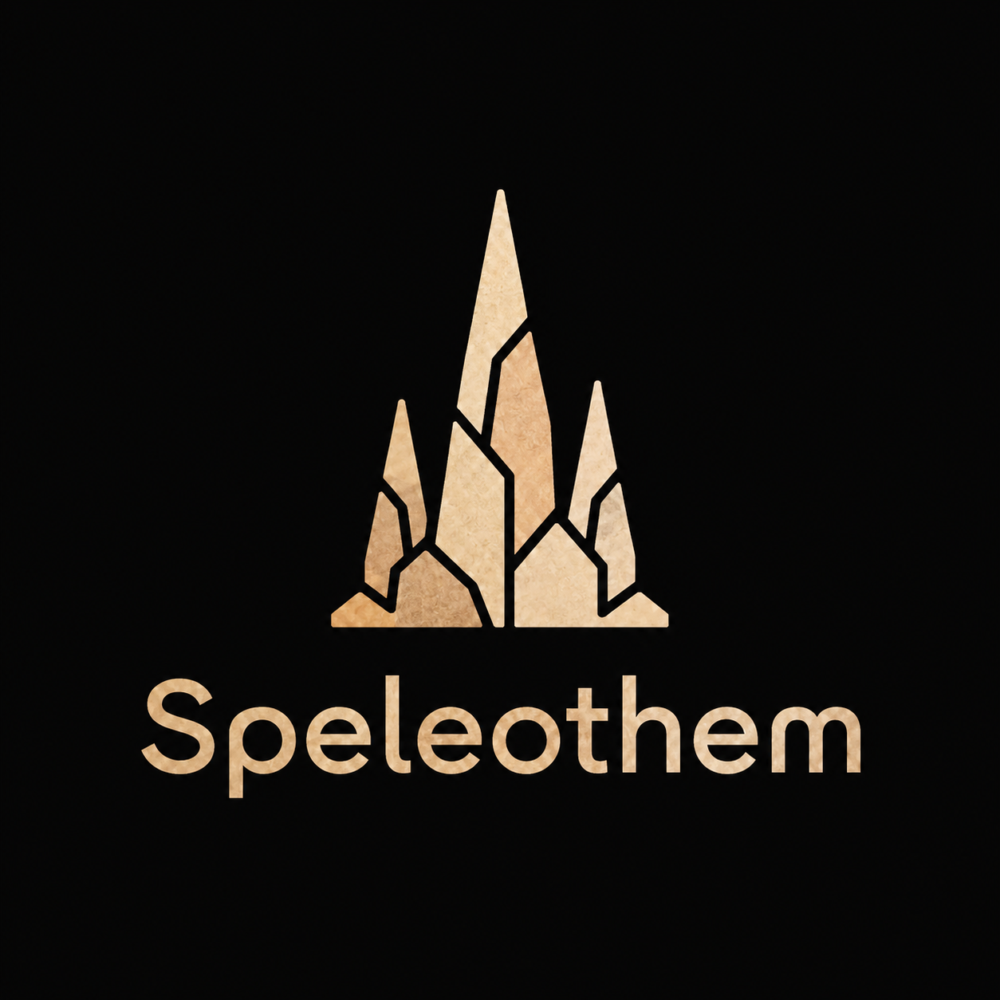

<p align="center">
  
</p>

# Speleothem

Speleothem 是一个面向大型生存和无政府服务器的高性能区域线程 Minecraft 服务端分支。

项目目标为 Java 25 和 Minecraft 26.2，并保留 Folia 的区域线程模型。Speleothem 由 libalpm64 维护，包含安全世界生成、NBT 安全修复、实体修正和网络防护。

Speleothem 最初是 Luminol 的分支。由于 Luminol 已不再作为活跃项目存在，Speleothem 现已作为独立项目继续开发，并维护自己的补丁集，同时保留上游署名。

## 下载

发行版本可从 [GitHub Releases](https://github.com/libalpm64/Speleothem/releases) 下载。

## 构建

```bash
git clone https://github.com/libalpm64/Speleothem.git
cd Speleothem
./gradlew applyAllPatches
./gradlew :speleothem-server:createPaperclipJar
```

可运行的服务端 JAR 位于 `speleothem-server/build/libs`。

## 补丁署名

Speleothem 保留 Folia、Paper、Luminol 及其上游项目的原始补丁作者和项目标记。由 libalpm64 维护的补丁使用 `Speleothem` 标记。

## 许可证

Speleothem 继承上游项目的许可证。详情请参阅 [LICENSE.md](LICENSE.md) 和 `licenses/`。
